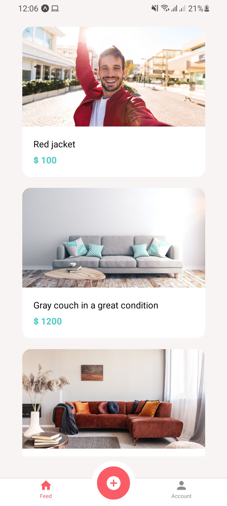
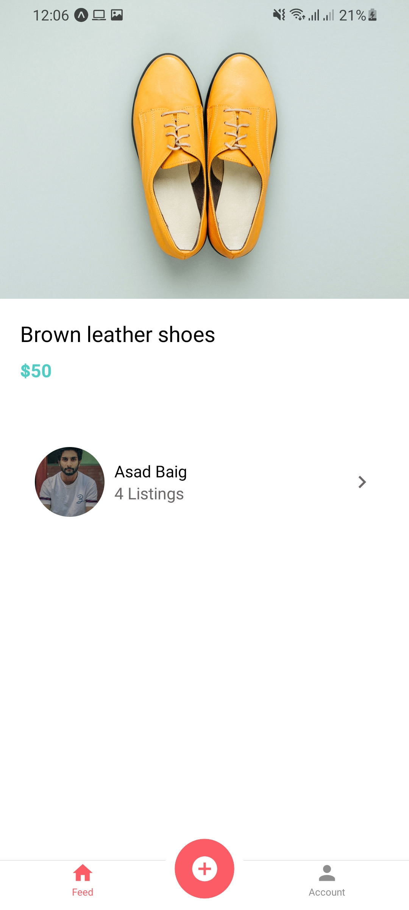
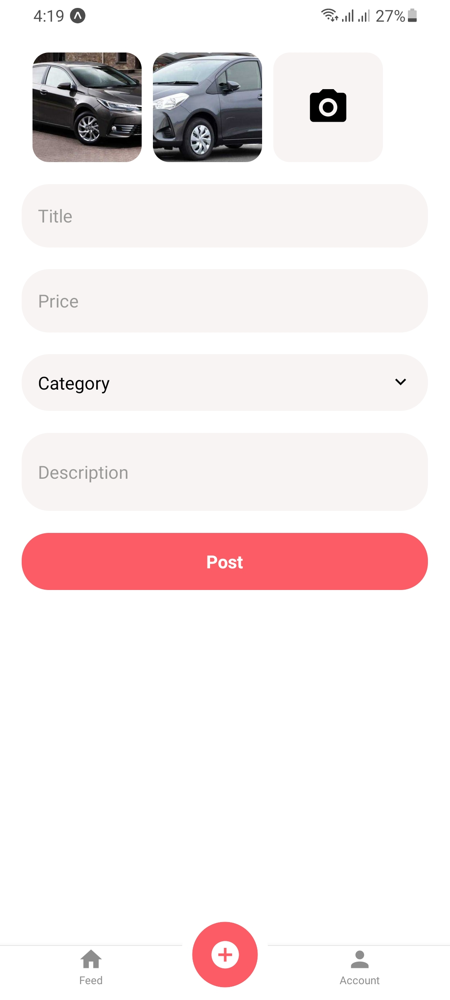
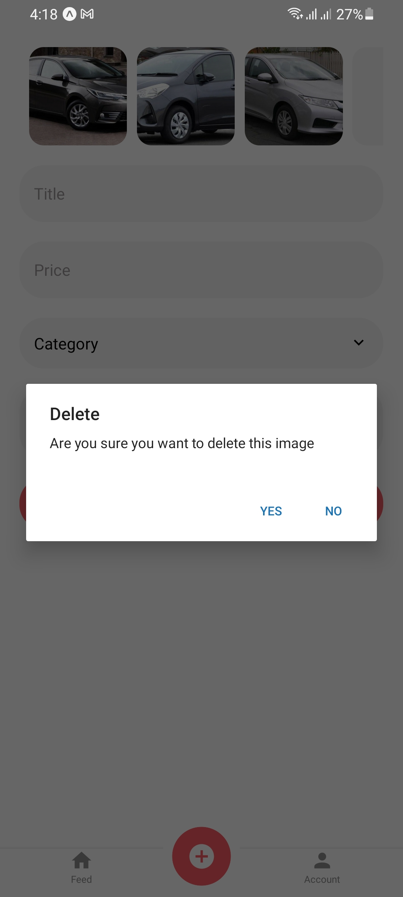
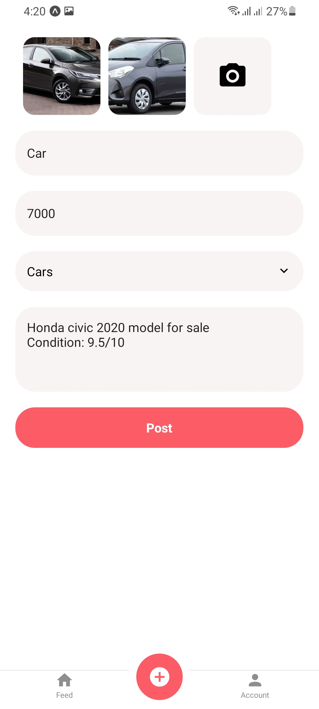
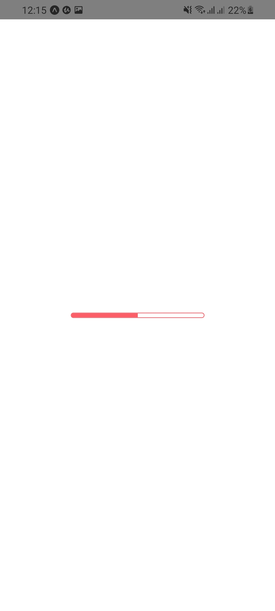
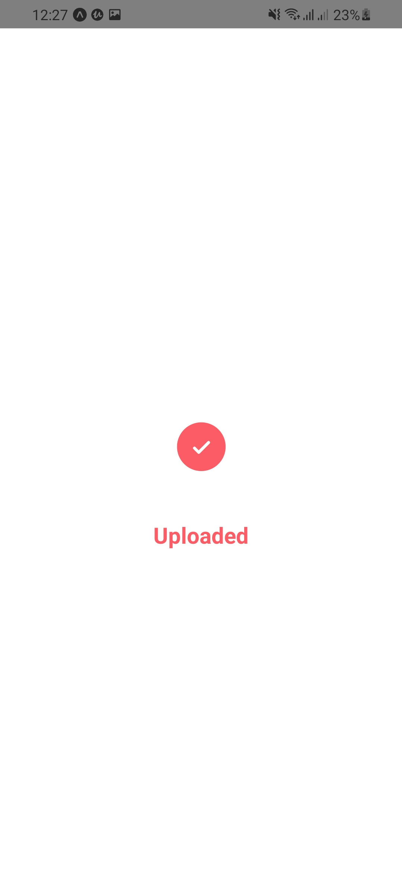
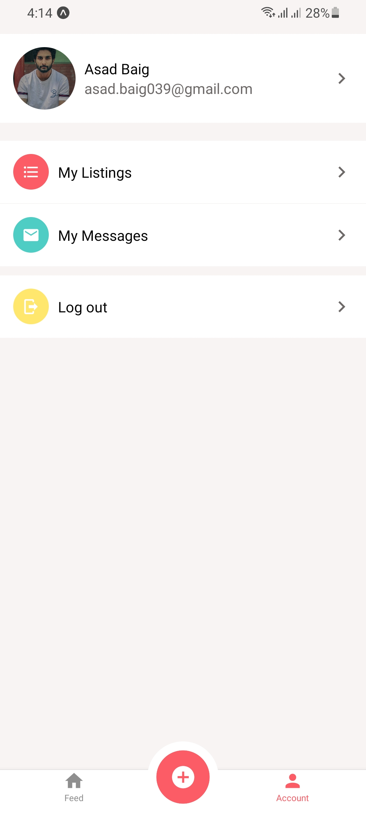

## About The Project

Sell it is a market place for selling the stuff you don't need anymore. This repository contains the front end of the application that is built using React Native Expo CLI.

## App UI ScreenShots

<p align="center">

<a>
    
    
    
    
    
    
    
    

</a>
</p>

### Installation

1. Clone the repo
   ```sh
   git clone https://github.com/AsadBaig039/Sell_It.git
   ```
2. Install NPM packages
   ```sh
   npm install
   ```
